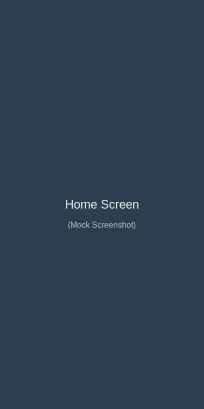
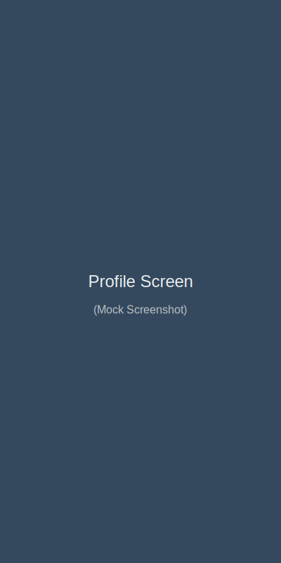
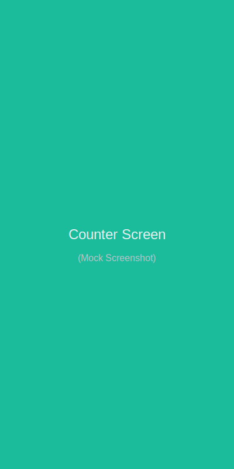

# FlutterMockApp

[](https://flutter.dev)
[](LICENSE)
[](https://github.com/hgosansn/FlutterMockApp/actions)

A **Flutter prototype** designed for local testing and feature validation. The goal is to establish a robust **development mode** workflow for a standalone application before considering backend integration or automated store delivery.

---

## Overview

<div align="center">
  
  
  
</div>

FlutterMockApp is a delivery-focused prototype designed to validate a standalone mobile app flow. The immediate goal is a single happy-path interaction running on a local development environment (Web, Desktop, or Simulator).

| Layer | Technology |
|---|---|
| Mobile App | Flutter (Dart) |
| State Management | Provider |
| CI/CD | GitHub Actions (Testing) |

---

## Roadmap

See [`ROADMAP.md`](ROADMAP.md) for the full phased delivery plan:

- **Phase 1** — Development Environment & Core App (Current Focus)
- **Phase 2** — Quality & Testing
- **Phase 3** — Native Platform Configuration (Deferred)
- **Phase 4** — CI Automation (Build & Test)
- **Phase 5** — Go-Live Readiness

---

## Getting Started

> 🚧 The project is currently focusing on getting the local environment ready for **development mode** testing.

```bash
# Clone the repo
git clone https://github.com/hgosansn/FlutterMockApp.git
cd FlutterMockApp/app

# Ensure Flutter SDK is installed.

# Install Flutter dependencies
flutter pub get

# Run the app in development mode
flutter run -t lib/main.dart --flavor dev
```

---

## Project Structure

```
FlutterMockApp/
├── app/                  # Flutter source
├── ROADMAP.md            # Phased delivery checklist
└── AGENTS.md             # Agent operating rules
```


## What works right now

```
  cd ./app
  flutter emulators --launch Medium_Phone_API_36.1
  flutter run -d emulator-5554 --debug --android-skip-build-dependency-validation
```

### Fixes to be applied

  Long-term fix (so you can remove the skip flag):


  - Update app/android/settings.gradle: com.android.application from 8.1.0 to at least 8.1.1 (prefer newer stable).
  - Update app/android/gradle/wrapper/gradle-wrapper.properties to Gradle 8.7+.


---

## Contributing

This project follows a single-agent delivery loop defined in [`AGENTS.md`](AGENTS.md). Each contribution should map to a checklist item in the roadmap.

---

## License

[MIT](LICENSE)
